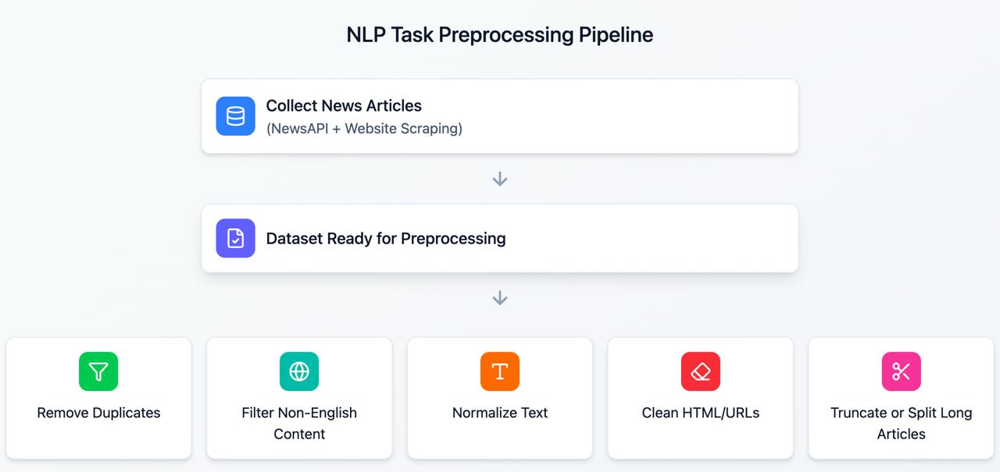
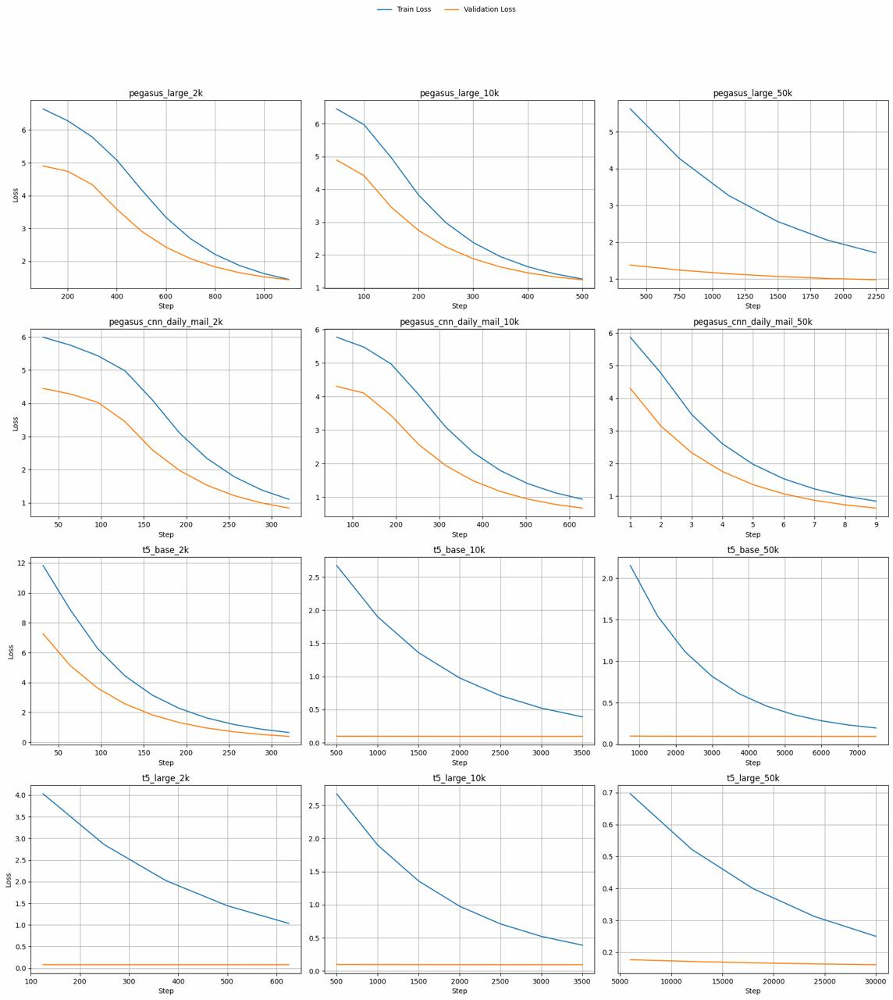
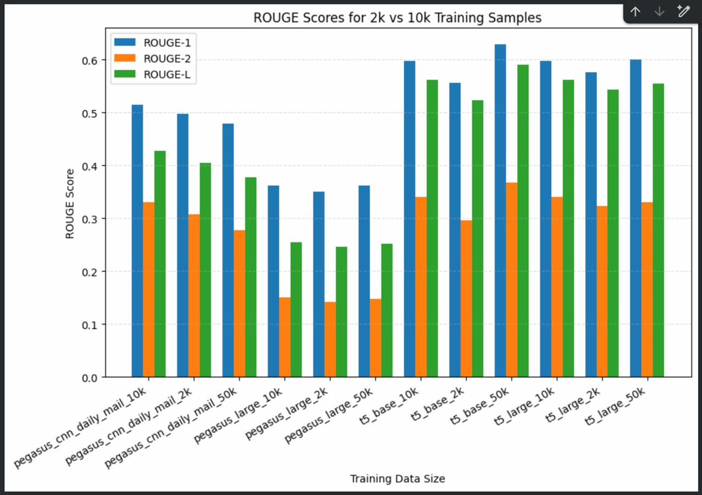
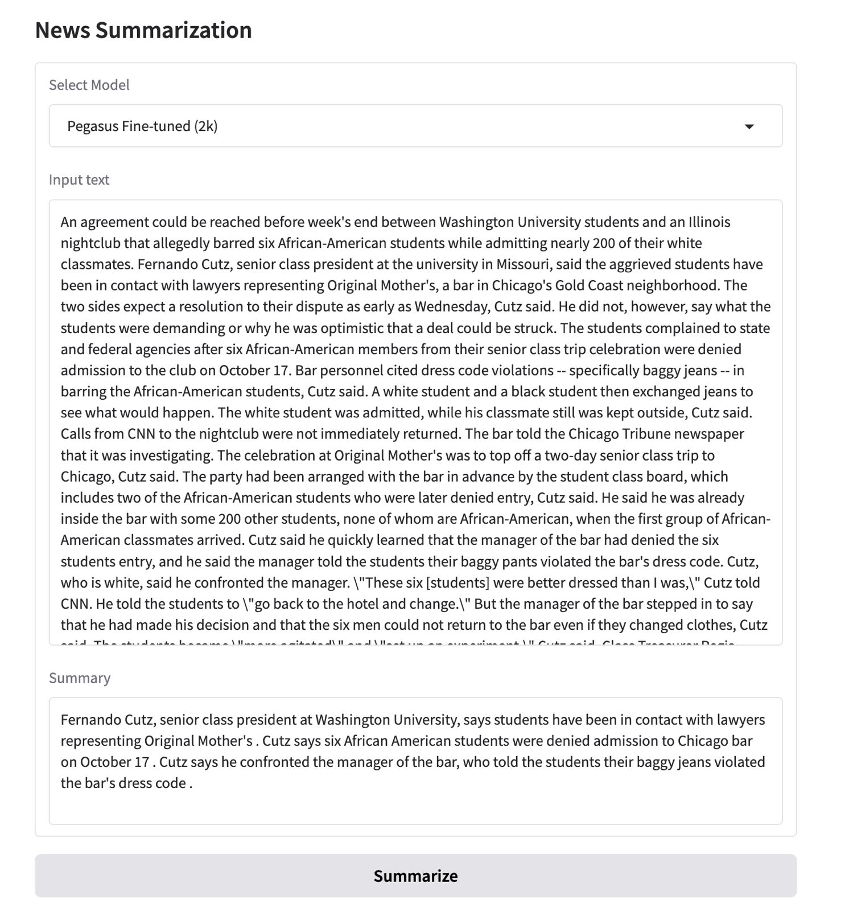

**University of Prishtina**  
**Faculty of Electrical and Computer Engineering**  
**Department of Computer and Software Engineering**  
**Master Studies**

---

# Event Extraction and Summarization from News Articles

## Course Information

This project was developed within the scope of the course **Natural Language Processing**, under the supervision of:

- **Professor:** Dr. Sc. Mërgim H. Hoti  

**Academic Year:** 2025 / 2026

---

### Team Members

- [Erna Hulaj](https://github.com/ernahulaj)
- [Laurent Arifaj](https://github.com/laurentarifaj1111)
- [Feride Berisha](https://github.com/ferideberisha)

---

## Project Overview

This repository presents an academic Natural Language Processing (NLP) project focused on **automatic news summarization** using modern **transformer-based architectures**. The project was completed as part of the Master studies program at the **Faculty of Electrical and Computer Engineering**, University of Prishtina.

The main goal of the project is to design and evaluate an end-to-end summarization pipeline capable of generating high-quality summaries from long-form news articles using different abstractive transformer models.

---

## Objectives

The primary objectives of this project are:

- To generate concise and coherent summaries from news articles  
- To compare the performance of different abstractive transformer models  
- To fine-tune state-of-the-art models on news datasets  
- To evaluate summarization quality using standard ROUGE metrics  
- To provide a reproducible and GPU-accelerated experimental workflow using Google Colab  

---

### 3. Dataset Source (NewsAPI)

The news articles used in this project were collected using the **NewsAPI** service.

- Articles were retrieved programmatically via the NewsAPI endpoints  
- Data includes article content and reference summaries  
- The collected raw data was further cleaned and processed before training as shown in figure below

Input datasets are provided in CSV format and include the following columns:

- **`article`** (or `Content`): Full news article text  
- **`highlights`** (or `Summary`): Reference summary used for training and evaluation  

---

## Models Used

The following transformer-based models were used and evaluated:

- **T5-base**
- **T5-large**
- **Pegasus-large**
- **Pegasus CNN/DailyMail**

Each model was fine-tuned using different dataset sizes (2k, 10k, and 50k samples) to analyze performance and generalization behavior.

---

## Model Fine-tuning

- Fine-tuning was performed using Google Colab with GPU acceleration  
- Mixed-precision training (fp16 / bf16) was used to optimize performance  
- Automatic checkpointing and best-model selection were enabled  
- Models were evaluated after each epoch using ROUGE metrics  

---

## Technologies Used

- **Programming Language:** Python  
- **Frameworks & Libraries:**  
  - PyTorch  
  - HuggingFace Transformers  
  - HuggingFace Datasets  
  - TensorBoard  
  - ROUGE-score  
- **Execution Environment:** Google Colab (GPU-enabled)

---

## Training & Validation Loss

The figure below illustrates the **training and validation loss curves** observed during model fine-tuning.  
These curves provide insight into convergence behavior and help identify potential overfitting.

---

## Evaluation Metrics

The performance of the summarization models was evaluated using **ROUGE metrics**.  
The figure below summarizes the achieved scores across different models and dataset sizes.

---

## Evaluation Metrics Used

Model performance was evaluated using standard summarization metrics:

- **ROUGE-1** – Unigram overlap  
- **ROUGE-2** – Bigram overlap  
- **ROUGE-L / ROUGE-Lsum** – Longest common subsequence  

All metrics were logged and visualized using **TensorBoard**.

---

## Experimental Workflow

1. Dataset preparation and preprocessing  
2. Selection of model architecture and dataset size  
3. Model fine-tuning using Google Colab with GPU support  
4. Monitoring training and validation metrics via TensorBoard  
5. Evaluation using ROUGE metrics  
6. Qualitative analysis of generated summaries  

---

## Gradio User Interface

To demonstrate the practical usability of the trained summarization models, a **Gradio-based web user interface** was implemented.

The Gradio UI allows users to:
- Input a news article as free text  
- Select a specific fine-tuned model (T5 or Pegasus variants)  
- Generate summaries interactively in real time  
- Compare outputs across different model configurations  

This interface provides an intuitive way to evaluate model behavior qualitatively and supports interactive experimentation without requiring direct access to the training notebooks.

---

---

## How to Run the Project (Google Colab)

This project is designed to run **entirely in Google Colab**.

### 1. Google Colab Requirements

- **Google Colab Pro is required**
- Runtime must use **A100 GPU**
- All training configurations are optimized for **A100 architecture**

> Free-tier GPUs (e.g., T4) are **not sufficient** for T5-large and Pegasus-large fine-tuning.

---

### 2. Hugging Face Authentication

This project requires access to Hugging Face models.

1. Create a Hugging Face account  
2. Generate a **Hugging Face access token**
3. In Google Colab:
   - Go to **Settings → Secrets**
   - Add a new secret:
     - **Name:** `HF_TOKEN`
     - **Value:** `<your_huggingface_token>`

The notebooks automatically read the token from the environment and authenticate with Hugging Face.

---

## License & Usage

This repository is intended for **academic use only**.  
Any reuse or redistribution of this work should properly reference the author and the **University of Prishtina – Hasan Prishtina**.
